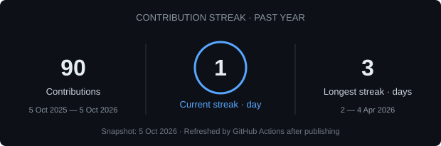
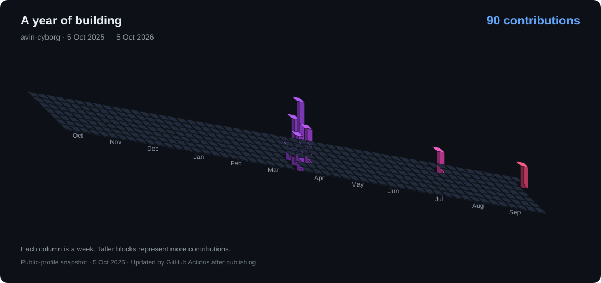

<!-- Profile: avin-cyborg/avin-cyborg -->

  

<h1 align="center">Hi, I'm Avinash 👋</h1>

  <b>AI Builder</b> • <b>Backend Developer</b> • <b>Curious by Default</b>

  I build AI tools, backend systems, and automation that people can use. 
  From crop-market workflows to AI chess benchmarks — I learn by building, shipping, and refining.

  
  

---

## 🚀 Featured Projects

### 🌾 RAW — Agricultural WhatsApp Automation

An AI-powered bot that turns raw WhatsApp crop offers into structured, translated updates for buyers. Deployed locally and used by **1,00+ agricultural brokers across Telangana**.

**✨ Key Features**

- Extracts crop-offer details from incoming messages using Gemini.
- Translates offers into target languages, including English and Telugu.
- Routes updates to buyer groups by crop type and language.
- Queues message processing, maintains logs, and reports processing failures.
- Provides a local dashboard to monitor activity and toggle automation.

**Tech Stack:** JavaScript, Node.js, Express, Gemini API, whatsapp-web.js, Socket.IO

  

---

### ♟️ Turing Arena — AI Decision-Making Benchmark

A platform for studying how language models make sequential decisions through competitive chess. Compares LLMs with Stockfish to investigate decision quality, rule compliance, and consistency.

** Key Features**

- Matches AI players from multiple providers against each other or Stockfish.
- Uses modular adapters for Gemini, OpenAI, and Claude.
- Streams game state to the frontend through WebSockets.
- Validates moves and handles invalid responses with retries and fallback logic.
- Separates game orchestration, player adapters, and provider integrations.

**Tech Stack:** Python, FastAPI, WebSockets, python-chess, Stockfish, SvelteKit, TypeScript

*The frontend and additional benchmark metrics are in development.*

  

  <a href="https://turing-arena-frontend.onrender.com/">Explore the basic chess demo →</a>

---

### 🧩 Matrix — Agent-Based Software Development

An experimental system exploring how AI agents can coordinate software development. A shared orchestrator brings management, development, and QA agents together around a user task.

** Current Structure**

- Separate agents for management, development, and quality assurance.
- An orchestration layer to coordinate the workflow.
- LLM integration and file tools to support software tasks.

**Tech Stack:** Python, LLM APIs, Agent Orchestration

*Early-stage exploration.*

  

---

## 🛠 Tech Stack

### Languages

### Backend & Real-Time Systems

### AI & Machine Learning

### Frontend & Tools

---

## 🔬 More Projects

| Project | What I explored |
| :--- | :--- |
| [🤟 Sign Ease](https://github.com/avin-cyborg/sign-ease) | Hand-gesture image classification with TensorFlow and a FastAPI prediction endpoint. |
| [🪽 Watchful Wings](https://github.com/avin-cyborg/Project1-Watchful_Wings) | A Python safety analytics prototype exploring threat detection and real-time alerts. |
| [💳 Mahatma Coin Wallet](https://github.com/avin-cyborg/Aadhaar-authenticated-crypto-wallet) | A React and TypeScript wallet prototype exploring Aadhaar-based authentication. |

---

## 🔭 What I'm Exploring

- **AI evaluation:** how language models behave when decisions must follow explicit rules.
- **Practical automation:** turning unstructured messages into useful workflows.
- **Agent systems:** coordinating planning, implementation, and review.

---

## 📈 GitHub Stats

  
  

  

---

## 📊 Contributions

  

---

## 📫 Connect With Me

  Have an idea for an AI tool, a backend system, or a workflow worth automating? 
  <a href="mailto:avinashsana2@gmail.com"><b>avinashsana2@gmail.com</b></a> •
  <a href="https://github.com/avin-cyborg"><b>GitHub</b></a>

  

